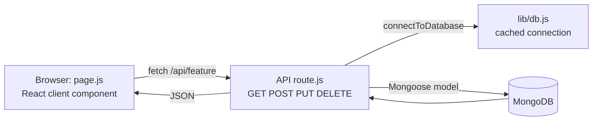
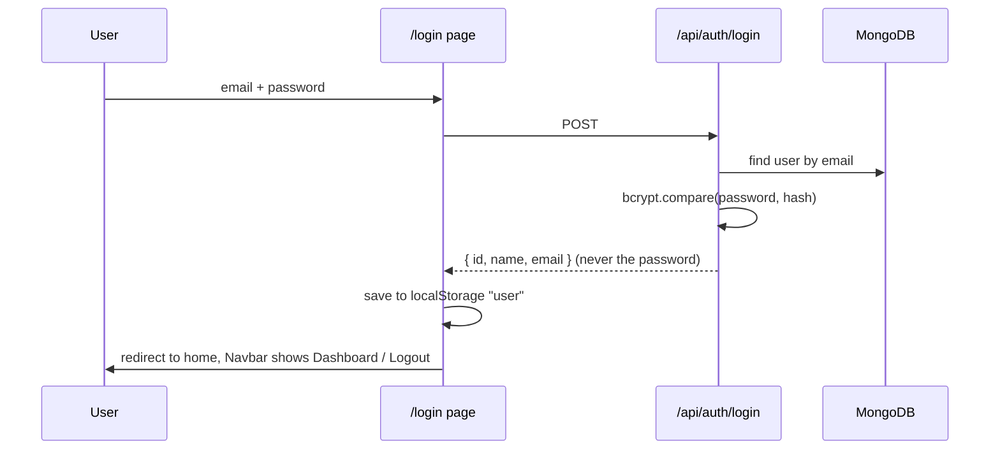

[Student-Helper-README.md](https://github.com/user-attachments/files/33103956/Student-Helper-README.md)
# Student Helper


**A campus platform for students, built as a full-stack web app.** It puts a dozen student tools in one place: course materials, deadlines, degree progress, a Q&A forum, study groups, tutors, a textbook marketplace, lost and found, and more. Students sign up once and every tool is available from a single navigation bar.

Built for **CSE 470** with Next.js, MongoDB and Tailwind CSS.

## Table of contents

1. [Features](#features)
2. [How the project is organised](#how-the-project-is-organised)
3. [How it works](#how-it-works)
4. [Page and API reference](#page-and-api-reference)
5. [Data models](#data-models)
6. [Getting started](#getting-started)
7. [Security notes and known limitations](#security-notes-and-known-limitations)
8. [Ideas for improvement](#ideas-for-improvement)
9. [Notes for future me](#notes-for-future-me)

## Features

The navigation bar groups the tools into three menus, plus a private dashboard for logged-in users.

### Academic

| Page | What it does |
| --- | --- |
| **Course Materials** (`/materials`) | Share links to notes, slides and past papers by course code. Anyone can upvote or downvote a link, and the score shown is upvotes minus downvotes. Filter by course code. |
| **Peer Tutors** (`/tutors`) | A directory of students offering tutoring, with courses, hourly rate (0 means volunteer) and availability. |
| **LaTeX Library** (`/latex`) | Share LaTeX snippets. Each one is rendered live with KaTeX and has a copy-to-clipboard button. |
| **Office Hours** (`/office-hours`) | Post a photo link of a professor's schedule. Other students can book a time slot, which is stored as a "booking" on that schedule. |
| **Thesis Repository** (`/thesis`) | Publish thesis and research abstracts with a department, tags and an optional PDF link. Searchable. |

### Community

| Page | What it does |
| --- | --- |
| **Q&A Forum** (`/forum`) | Ask a question for a course and reply to others. Replies are stored inside the question. |
| **Study Groups** (`/study-groups`) | Create a group with a time, place and member limit. Others can join until it is full. Only upcoming groups are shown. |
| **Teammate Finder** (`/teammates`) | Post a project idea and the skills you need. |
| **Skill Exchange** (`/skill-exchange`) | Barter board: "I can teach X, I want to learn Y". |
| **Course Reviews** (`/reviews`) | Rate a course from 1 to 5 stars with a written review. Filter by course code. |
| **Alumni Mentors** (`/alumni`) | Alumni list what they offer (resume review, mock interviews). Searchable by company, major or job title. |
| **Interview Prep** (`/interviews`) | A shared bank of real interview questions with company, role, type and difficulty. Searchable. |

### Campus

| Page | What it does |
| --- | --- |
| **Event Calendar** (`/events`) | Post and browse upcoming campus events. Past events are hidden. |
| **Marketplace** (`/textbooks`) | Buy and sell used textbooks with a price and condition. |
| **Lost & Found** (`/lost-and-found`) | A bulletin board for lost and found items. Posts can be removed once an item is returned. |
| **Campus Directory** (`/directory`) | Find rooms, labs and offices by name, building, room number or category. |

### Private tools (login required)

These live behind the **Dashboard** (`/dashboard`) and only show a user their own data.

| Page | What it does |
| --- | --- |
| **Dashboard** (`/dashboard`) | Welcome screen with shortcuts to the private tools, and a sticky-note **Scratchpad Wall** with colour choices. |
| **Deadlines** (`/assignments`) | Track assignments with course code, due date and urgency (High, Medium, Low). Tick them off when done. |
| **Degree Progress** (`/progress`) | Enter total and completed credits (default total is 120) and a checklist of degree requirements. A progress percentage is shown. |
| **Experience Log** (`/extracurriculars`) | A private digital resume of clubs, hackathons, certifications and volunteering. |

## How the project is organised

```
src/
├── app/
│   ├── layout.js            Wraps every page with the Navbar
│   ├── page.js              Home page (Get Started / Log In)
│   ├── globals.css          Global styles
│   ├── login/ register/     Auth pages
│   ├── dashboard/           Private dashboard + scratchpad notes
│   ├── <feature>/page.js    One folder per tool (materials, tutors, forum, ...)
│   └── api/
│       ├── auth/login/      POST: log in
│       ├── auth/register/   POST: sign up
│       └── <feature>/route.js   One REST endpoint per tool
├── components/
│   └── Navbar.js            Top bar with dropdown menus and login state
├── lib/
│   └── db.js                MongoDB connection helper (cached)
└── models/
    └── <Name>.js            One Mongoose schema per kind of data (21 models)
```

The pattern repeats for every feature. A folder under `app/` holds the **page** the user sees, a matching folder under `app/api/` holds the **API route** that talks to the database, and a file under `models/` describes the **shape of the data**. Once you understand one feature, you understand all of them.

## How it works



**1. Pages are client components.** Each `page.js` starts with `"use client"` and keeps its data in React state (`useState`). When the page loads, `useEffect` calls `fetch("/api/<feature>")`, and the result fills the screen. Forms send a `POST` request and then refresh the list.

**2. API routes are the back end.** Each `route.js` exports functions named after HTTP methods. This is the Next.js App Router convention:

| Method | Used for |
| --- | --- |
| `GET` | Read the list (sometimes filtered with a query such as `?courseCode=CSE470` or `?userEmail=...`) |
| `POST` | Create a new record |
| `PUT` | Update one: toggle an assignment, vote on a material, reply to a question, join a study group, book an office hour |
| `DELETE` | Remove a record by `?id=...` |

Most routes set `export const dynamic = 'force-dynamic'`, so Next.js never caches them and users always see fresh data.

**3. One shared database connection.** `src/lib/db.js` exports `connectToDatabase()`. It stores the connection on `global.mongoose` so that repeated API calls (and hot reloads in development) reuse one connection instead of opening a new one each time. It throws a clear error if `MONGODB_URI` is missing.

**4. Models describe the data.** Each file in `src/models/` defines a Mongoose schema with required fields, defaults and, in some cases, allowed values (`enum`). Every model ends with `mongoose.models.X || mongoose.model('X', schema)`, which stops Mongoose from redefining the model during hot reload.

**5. Login.**



- **Register** (`/api/auth/register`) checks all fields are filled and the email is unused, then stores a **bcrypt hash** of the password (10 salt rounds), never the password itself.
- **Login** returns only `id`, `name` and `email`.
- The browser keeps that object in `localStorage` under the key `user`. The `Navbar` reads it to decide whether to show *Login / Sign Up* or *Dashboard / Logout*. Logging out just deletes the key.

**6. "Who owns this?"** Records that belong to a person carry a `userEmail` field. Private tools such as assignments, notes and degree progress ask the API for `?userEmail=<your email>`, so each user only sees their own. On shared boards (thesis, alumni, and so on) the page shows the **Delete** button only when `user.email` equals the record's `userEmail`.

## Page and API reference

Every API route lives at `/api/<name>`.

| Page folder | API route | Methods | Notes |
| --- | --- | --- | --- |
| `alumni` | `alumni` | GET, POST, DELETE | Delete button shown to the owner |
| `assignments` | `assignments` | GET, POST, PUT, DELETE | `GET` needs `?userEmail=`. `PUT` toggles `isCompleted`. |
| `dashboard` | `notes` | GET, POST, DELETE | Sticky notes, `GET` needs `?userEmail=` |
| `directory` | `directory` | GET, POST, DELETE | Backed by the `Location` model. Sorted by building, then room. |
| `events` | `events` | GET, POST, DELETE | `GET` returns only events from today onward |
| `extracurriculars` | `extracurriculars` | GET, POST, DELETE | Private to the user |
| `forum` | `questions` | GET, POST, PUT | `PUT` adds a reply |
| `interviews` | `interviews` | GET, POST, DELETE | |
| `latex` | `latex` | GET, POST, DELETE | Rendered with `react-katex` |
| `lost-and-found` | `lost-and-found` | GET, POST, DELETE | |
| `materials` | `materials` | GET, POST, PUT | `PUT` with `action: "upvote"` or `"downvote"`. Filter with `?courseCode=`. |
| `office-hours` | `office-hours` | GET, POST, PUT, DELETE | `PUT` pushes a booking onto the schedule |
| `progress` | `progress` | GET, POST | `POST` upserts one document per user |
| `reviews` | `reviews` | GET, POST | Filter with `?courseCode=` |
| `skill-exchange` | `skill-exchange` | GET, POST, DELETE | |
| `study-groups` | `study-groups` | GET, POST, PUT, DELETE | `GET` returns future meetings only. `PUT` joins unless the group is full. |
| `teammates` | `teammates` | GET, POST, DELETE | |
| `textbooks` | `textbooks` | GET, POST, DELETE | |
| `thesis` | `thesis` | GET, POST, DELETE | |
| `tutors` | `tutors` | GET, POST, DELETE | |
| `login`, `register` | `auth/login`, `auth/register` | POST | See the login flow above |

## Data models

All in `src/models/`. Almost every model also has a `createdAt` date.

| Model | Key fields |
| --- | --- |
| `User` | name, email (unique), password (hashed) |
| `Assignment` | title, courseCode, dueDate, urgency (`High` / `Medium` / `Low`), isCompleted, userEmail |
| `Progress` | userEmail (unique), totalCredits (default 120), completedCredits, requirements (a list of `{ name, isCompleted }`) |
| `Note` | content, color (default `bg-yellow-200`), userEmail |
| `Extracurricular` | role, organization, category, timeframe, description, userEmail |
| `Material` | title, courseCode, category, link, upvotes, downvotes |
| `Tutor` | name, courses, hourlyRate, availability, contactInfo |
| `LatexSnippet` | title, latexCode, description, author, userEmail |
| `OfficeHour` | professorName, courseCode, location, scheduleImageUrl, postedBy, userEmail, bookings (a list of `{ studentName, studentEmail, timeSlot }`) |
| `Thesis` | title, author, department, abstract, tags, pdfUrl (optional), userEmail |
| `Question` | title, courseCode, body, author, replies (a list of `{ text, author }`) |
| `StudyGroup` | title, courseCode, topic, meetingTime, location, maxMembers (at least 2), currentMembers |
| `TeammatePost` | title, description, skills, author, contactInfo, userEmail |
| `SkillExchange` | title, offering, seeking, description, author, contactInfo, userEmail |
| `Review` | courseCode, rating (1 to 5), text |
| `Alumnus` | name, graduationYear, major, currentCompany, jobTitle, offerings, contactInfo, userEmail |
| `InterviewQuestion` | company, role, type, difficulty, question, author, userEmail |
| `Event` | title, date, location, description, organizer |
| `Textbook` | title, author, courseCode, price, condition (`New` to `Poor`), contactInfo |
| `LostAndFoundItem` | title, type (`Lost` / `Found`), date, location, description, contactInfo |
| `Location` | name, building, roomNumber, category, description, addedBy, userEmail |

Two models store a list **inside** a document (`Question.replies`, `OfficeHour.bookings`). That is a MongoDB habit: keep things that are always read together in one place.

## Getting started

### What you need

- **Node.js** (the current LTS version from [nodejs.org](https://nodejs.org))
- A **MongoDB** database. The easiest is a free cluster on [MongoDB Atlas](https://www.mongodb.com/atlas), or a local MongoDB install.

### 1. Clone and install

```bash
git clone https://github.com/student-helper-cse-470/student-helper.git
cd student-helper
npm install
```

The code imports `next`, `react`, `mongoose`, `bcryptjs`, `katex` and `react-katex`, and uses Tailwind CSS for styling. `npm install` installs everything listed in `package.json`.

### 2. Add your database address

Create a file named `.env.local` in the project root:

```
MONGODB_URI=mongodb+srv://<user>:<password>@<cluster>.mongodb.net/student-helper
```

For a local database use `mongodb://127.0.0.1:27017/student-helper`.

The app will not start without this variable. Never commit `.env.local`.

### 3. Run it

```bash
npm run dev
```

Open <http://localhost:3000>, click **Get Started**, create an account, and explore.

## Security notes and known limitations

This was built as a course project, so some things are simplified. Knowing them is useful both for a demo and for future work.

- **Passwords are hashed** with bcrypt, which is good practice. 
- **Login is not a real session.** The server returns the user's details and the browser stores them in `localStorage`. The API routes do not check who is calling. Anyone who can send requests to the API could read or delete records by guessing an id or an email. The Delete buttons are hidden by the page, but the server does not enforce it.
- **Private data is protected only by the email in the URL.** Routes such as `/api/assignments?userEmail=...` return whatever email they are given.
- **No input limits.** Fields are checked for presence but not for length or format, and link fields accept any text.
- **No rate limiting.** Voting and joining a study group can be repeated by the same user. There is no check that one person votes or joins only once.
- **Some boards are anonymous.** Events, textbooks, lost and found, and reviews do not need a login to post.

## Ideas for improvement

- Real sessions or tokens (for example JWT cookies or NextAuth), with the server checking ownership before every update or delete
- Check that a person can vote and join a group only once
- Image upload for office-hour schedules and lost items, instead of pasting a link
- Search and filters on every board
- Email or in-app reminders for deadlines
- Input validation (lengths, URL format) on the server
- A test suite for the API routes

## Notes for future me

A short guide to reading this project again after a long break.

1. **Start with `src/lib/db.js`, `src/models/User.js` and `src/app/api/auth/`.** This is the smallest complete example of model, route and connection together.
2. **Then read one feature end to end.** `materials` is a good one: `models/Material.js`, `api/materials/route.js` and `app/materials/page.js`. It shows GET with a filter, POST, and a PUT that changes a number.
3. **Every other feature is a copy of that pattern.** If you want to add a new tool, copy a folder, rename the model, change the fields, and add a link in `Navbar.js`.
4. **To add a page to the menu,** edit the `menuGroups` list at the top of `src/components/Navbar.js`.
5. **If the app crashes at start-up,** check that `.env.local` exists and `MONGODB_URI` is set. That is the first thing `db.js` checks.
6. **If a page says "Failed to fetch",** open the terminal running `npm run dev`. The API routes print the real error with `console.error`.

## License

No licence has been chosen yet. Add a `LICENSE` file if you want others to reuse the code.
